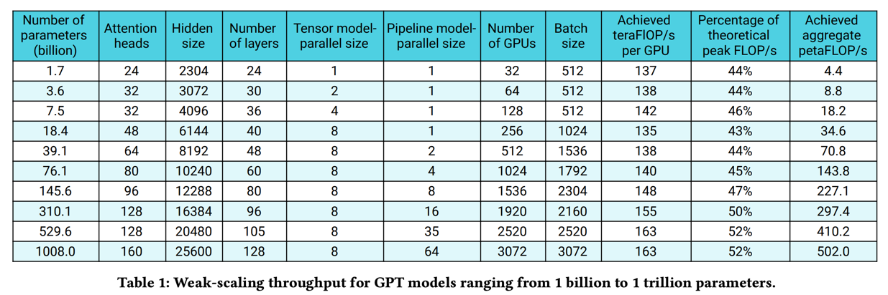

# Title

# Team


## CO2e calculation

The total carbon footprint ``CO2eq`` resulting from LLM processing is determined by
```
CO2eq = CO2eq_oper + CO2eq_emb
```
where ``CO2eq_oper`` indicates the operational carbon footprint of the LLM,
and ``CO2eq_emb`` denotes the embodied carbon footprint of the LLM.

## embodied carbon footprint
To quantify the chip’s embodied carbon footprint ``CO2eq_chip`` within a specific hardware unit is calculated by
```
CO2eq_chip = area ⋅ 𝐶𝑃𝐴
```
where ``area`` represents the chip’s area. CPA看看这里要不要介绍（The Carbon emitted Per unit Area (
𝐶𝑃𝐴
) is contingent on various semiconductor fabrication parameters, including yield, energy consumption per unit area during manufacturing, emissions from chemicals utilized in hardware production, and emissions associated with raw material sourcing for fabrication. ）


## operational carbon footprint
The operational carbon footprint ``CO2eq_oper`` attributed to LLM processing is calculated by
```
CO2eq_oper = energy_oper ⋅ carb_inten
```
where ``energy_oper`` represents the operational energy for LLM processing, and ``carb_inten`` denotes
the carbon intensity of the specific data center.

### operational energy
The operational energy ``energy_oper`` associated with LLM processing can be calculated by
```
energy_oper = energy_hard ⋅ PUE
```
where ``energy_hard`` denotes the energy used by the computing hardware within a data center, and
``PUE`` indicates the PUE of the specific data center.

### hardware energy
The single unit ``i`` energy ``energy_hard_i`` consumed by
```
energy_hard_i = P_i ⋅ eff_i ⋅ n_i ⋅ t_i
```
where  
``P_i`` denotes the peak power of hardware unit ``i``;  
``eff_i`` represents the hardware
efficiency of hardware unit ``i``;  
``n_i`` indicates the count of hardware unit ``i``;  
``t_i``means the execution time of hardware unit ``i``;  
Hardware units encompass a range of components, including CPUs, LLM computing devices, memories, SSDs, and others.
The total energy ``energy_hard`` consumed by all hardware units.

### hardware efficiency
Efficient processing of LLMs relies on achieving high hardware efficiency,
which is calculated as the actual computing throughput divided by the peak throughput.

Hardware efficiency may be measured. Narayanan et al. have measured the throughput for end-to-end training, i.e.,
includes all operations including data loading, optimizer steps, communication, and logging.
We achieve 52% of peak device throughput for the largest model, and 44% of peak device throughput for the smallest model.
Table 1 shows the model configurations along with the achieved FLOP/s (both per GPU and aggregate over all GPUs).


Also, it may be used regression coefficients for estimating. The optimal parallelism setting is represented as
``p``,``t``,``d``,``e``, where each variable corresponds to a degree of pipeline, tensor, data, and expert parallelism, respectively.
The efficiency ``eff_re`` with ``re`` devices can be calculated by
```
when re < n,
eff_re = r_0 ⋅ re / n ⋅ eff_n

when re > n,
eff_re = r_1 ⋅ re / n ⋅ eff_n + r_2 ⋅ re
```
, where ``r_0``, ``r_1``, ``r_2``are fitting constants, ``eff_n``means the highest hardware efficiency,
and ``n``indicates the number of devices that can achieve ``eff_n``. The number of devices required to achieve optimal hardware efficiency for dense LLM processing is calculated as
``n = t ⋅ p ⋅ d``(Narayanan et al., 2021).

### training time

 


